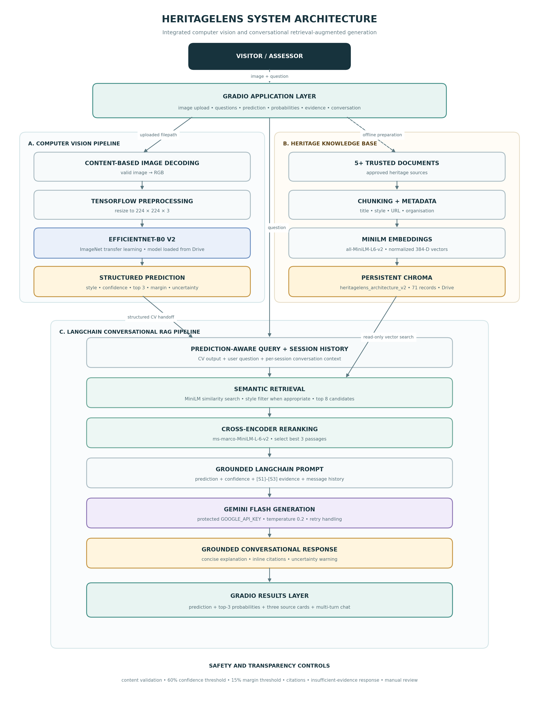

# HeritageLens — ML02 Coursework

HeritageLens is an educational AI prototype that classifies a building image into one of five architectural styles and then explains the prediction using retrieved heritage evidence and a conversational large language model.

## Final system

The system combines two pipelines:

1. A leakage-controlled EfficientNet-B0 image classifier predicts **Romanesque, Gothic, Tudor Revival, Georgian, or Art Deco**.
2. A LangChain conversational RAG pipeline retrieves relevant heritage passages from Chroma, reranks them, and asks Gemini to produce a grounded answer with `[S1]`–`[S3]` citations.

The final Gradio application displays the predicted class, confidence, top-three probabilities, uncertainty status, retrieved source cards, grounded explanation, and session-aware follow-up conversation.



## Confirmed final results

| Item | Final value |
|---|---:|
| Computer-vision architecture | EfficientNet-B0 transfer learning |
| Input | 224 × 224 RGB image |
| Architectural classes | 5 |
| Leakage-controlled V2 split | 1,361 train / 302 validation / 313 test |
| Correct test predictions | 288 / 313 |
| Test accuracy | 92.01% |
| Macro F1 | 0.9119 |
| Weighted F1 | 0.9209 |
| Chroma collection | `heritagelens_architecture_v2` |
| Knowledge records | 71 |
| Vector retrieval | Top 8 candidates |
| Cross-encoder output | Best 3 passages |

## Repository structure

```text
heritagelens-ml02/
├── README.md
├── requirements.txt
├── .gitignore
├── notebooks/
│   ├── HeritageLens_Model_Training.ipynb
│   └── HeritageLens_FINAL_RAG_v3_Production.ipynb
├── docs/
│   ├── system_architecture.png
│   ├── SYSTEM_ARCHITECTURE.md
│   └── RESULTS.md
└── artifacts/
    ├── MODEL.md
    └── KNOWLEDGE_BASE.md
```

## Notebooks

### 1. Model training and evaluation

`notebooks/HeritageLens_Model_Training.ipynb` contains the complete dataset preparation, duplicate and leakage audit, transfer-learning workflow, fine-tuning, evaluation, representative predictions, and Grad-CAM analysis. Its official V2 outputs are saved in the notebook, so retraining is not required for assessment or viva review.

### 2. Final conversational RAG application

`notebooks/HeritageLens_FINAL_RAG_v3_Production.ipynb` is the final restart-safe application. It loads the completed model and existing 71-record Chroma collection; it does not retrain the classifier or rebuild the database.

Run it from top to bottom in a fresh Google Colab runtime after placing the required artifacts in Google Drive and adding the Gemini API key as described below.

## Required Google Drive layout

```text
MyDrive/
└── HeritageLens/
    ├── models/
    │   └── efficientnetb0_v2_phase2_best.keras
    └── PartC_RAG/
        └── vector_database/
            ├── chroma.sqlite3
            └── [Chroma collection data]
```

The model and vector database are runtime artifacts rather than notebook source. See [artifacts/MODEL.md](artifacts/MODEL.md) and [artifacts/KNOWLEDGE_BASE.md](artifacts/KNOWLEDGE_BASE.md).

## Gemini API key

In Google Colab, open **Secrets**, add a secret named `GOOGLE_API_KEY`, and enable notebook access. Never paste an API key into a notebook cell or commit it to GitHub. If the secret is unavailable, the final notebook requests the key through a secure hidden prompt.

## Running the final application

1. Upload or copy the repository notebooks into Google Colab.
2. Confirm the model and Chroma database use the Drive layout shown above.
3. Add the `GOOGLE_API_KEY` Colab secret.
4. Open `HeritageLens_FINAL_RAG_v3_Production.ipynb` in a fresh runtime.
5. Select **Runtime → Run all**.
6. Confirm that the notebook reports:
   - `efficientnetb0_v2_phase2_best.keras`
   - collection `heritagelens_architecture_v2`
   - 71 stored records
   - model input `(None, 224, 224, 3)`
   - model output `(None, 5)`
7. Open the temporary Gradio URL and test an architectural image.

## Core technologies

- TensorFlow/Keras and EfficientNet-B0
- NumPy, pandas, scikit-learn, Matplotlib and Seaborn
- Chroma vector database
- `sentence-transformers/all-MiniLM-L6-v2` embeddings
- `cross-encoder/ms-marco-MiniLM-L-6-v2` reranker
- LangChain conversational pipeline and message history
- Google Gemini API
- Gradio 6.20.0

## Limitations

- The five-class dataset does not represent every architectural style, region, or historical period.
- Visually similar styles and mixed-style buildings can produce uncertain predictions.
- Grad-CAM indicates influential image regions but does not prove human-like architectural reasoning.
- RAG reduces hallucination risk but cannot guarantee that every generated sentence is correct.
- The current implementation uses Google Drive and Colab paths and is intended as a coursework prototype rather than a continuously hosted production service.

## Academic use

This repository documents an individual ML02 coursework prototype. The saved metrics refer only to the official leakage-controlled V2 evaluation. API keys, raw datasets, personal credentials, and temporary Gradio links are intentionally excluded.
